# 🌐 Frontend Application - Gestion des Services de Messagerie et de Transport 🚚✈️

## 🚀 Introduction

Ce projet constitue le côté **frontend** d'une application web dédiée à la **gestion des services de messagerie et de transport**. Développée avec **Angular**, cette application joue un rôle crucial dans la gestion des différents types de voyages offerts par une agence de voyage. L'accent est mis sur la prise en compte de la disponibilité et de la conformité des véhicules et des conducteurs pour chaque type de voyage.

## 🛠️ Fonctionnalités Principales

### 👨‍✈️ Gestion des Conducteurs

L'application permet aux utilisateurs de l'agence de **gérer les conducteurs** de manière complète :
- **Permis de conduire** : Suivi de la date d'expiration des permis et des types de véhicules que chaque conducteur est autorisé à conduire.
- **Historique et qualifications** : Gestion des qualifications spécifiques des conducteurs et des formations requises.

### 🚗 Gestion des Véhicules

La gestion des véhicules est un autre aspect clé de l'application :
- **Assurance** : Suivi de l'état de l'assurance des véhicules, avec des rappels pour les renouvellements.
- **Carte grise & vignette** : Gestion de la carte grise et de la vignette, y compris les dates d'expiration.
- **Visite technique** : Suivi des visites techniques pour s'assurer que tous les véhicules sont conformes.

### 🛌 Gestion des Repos des Conducteurs

Pour garantir le bien-être des conducteurs et la conformité avec les régulations, l'application permet :
- **Planification des repos** : Gestion des dates de repos des conducteurs pour éviter toute surcharge de travail et pour respecter les lois sur les temps de repos.
- **Conflits d'horaires** : Vérification des disponibilités en fonction des périodes de repos et des voyages prévus.

### 🗺️ Affichage des Voyages

L'application offre une interface pour **afficher les voyages** planifiés ou à venir :
- **Vue d'ensemble** : Les utilisateurs peuvent voir les détails des voyages, y compris les conducteurs et les véhicules assignés.
- **Historique des voyages** : Accès à l'historique des voyages pour une analyse postérieure.

### ✈️ Création de Nouveaux Voyages

L'un des aspects les plus complexes de l'application est la **création de nouveaux voyages** :
- **Type de voyage** : En fonction du type de voyage, l'application détermine les types de véhicules et de permis requis.
- **Disponibilité et Conformité** : Le système vérifie à la fois la disponibilité et la conformité des conducteurs et des véhicules :
  - Conducteurs : Les conducteurs doivent être disponibles (non affectés à un autre voyage ou à une période de repos à la date du voyage) et conformes (leurs permis doivent être valides et correspondre au type de véhicule requis pour le voyage).
  - Véhicules : Les véhicules doivent être conformes (assurance, carte grise, vignette, et visite technique valides pendant les dates du voyage) et disponibles (non utilisés pour un autre voyage à la même date).
- **Assignation intelligente** :  L'application sélectionne les conducteurs et véhicules appropriés en s'assurant qu'ils répondent à tous les critères de conformité et de disponibilité.

### 🖼️ Captures d'Écran

Voici quelques captures d'écran illustrant les différentes interfaces de l'application :

#### 🖥️ Interface de Gestion des Conducteurs

##### - Liste des conducteurs
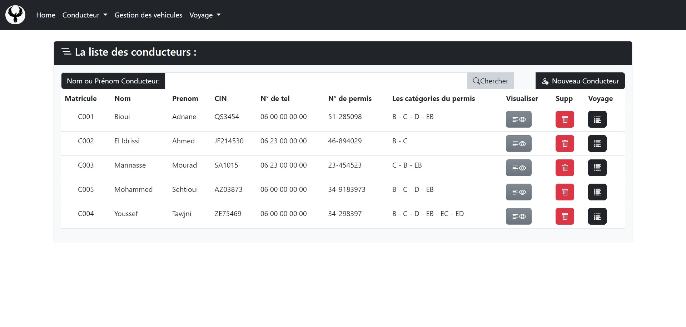

##### - Modifier un conducteur
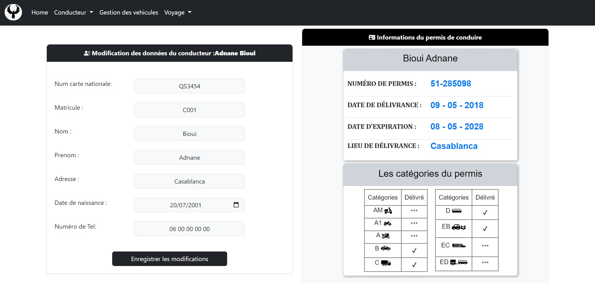

##### - Modifier un permis de conduite
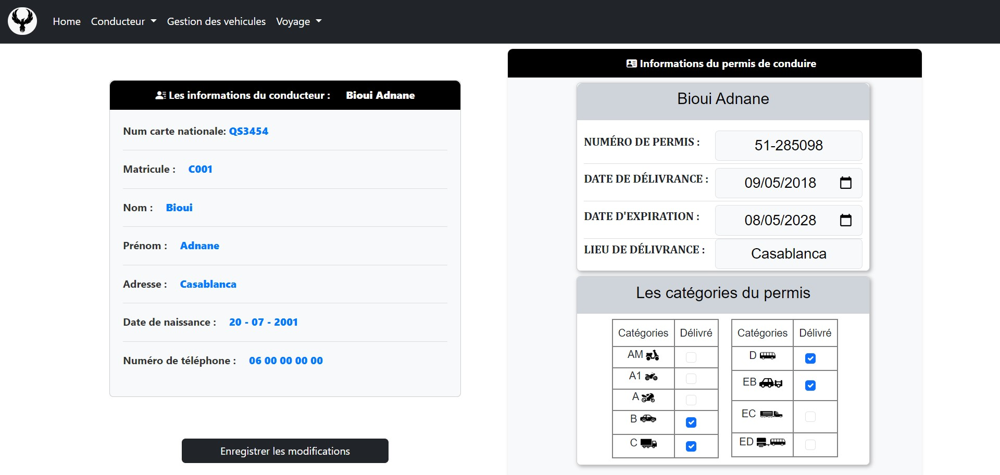

##### - Afficher les détails d'un conducteurs
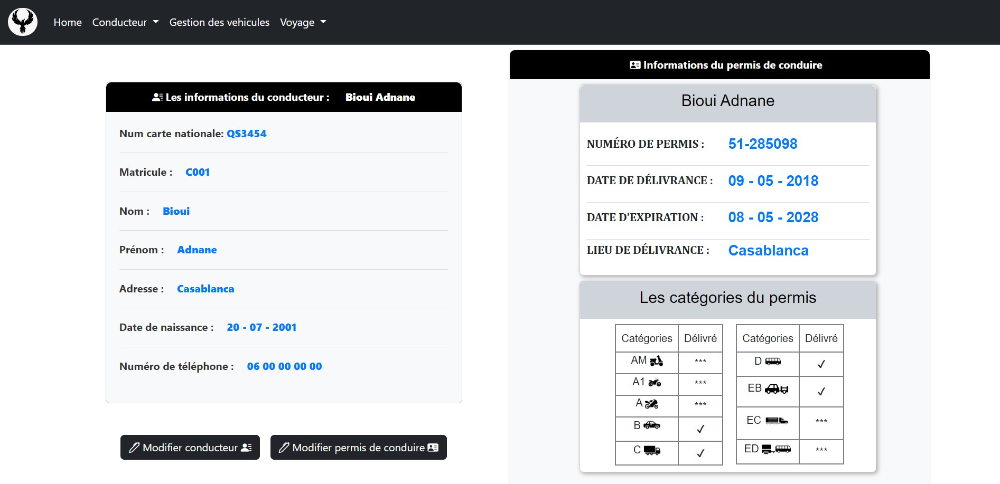

#### 🚗 Interface de Gestion des Véhicules

##### - Liste des véhicules
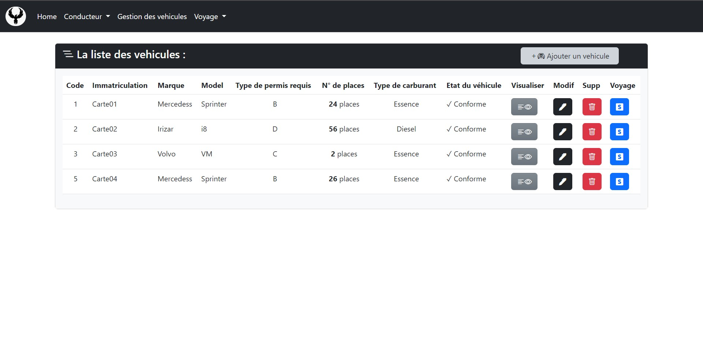

##### - Création d'un nouveau véhicule
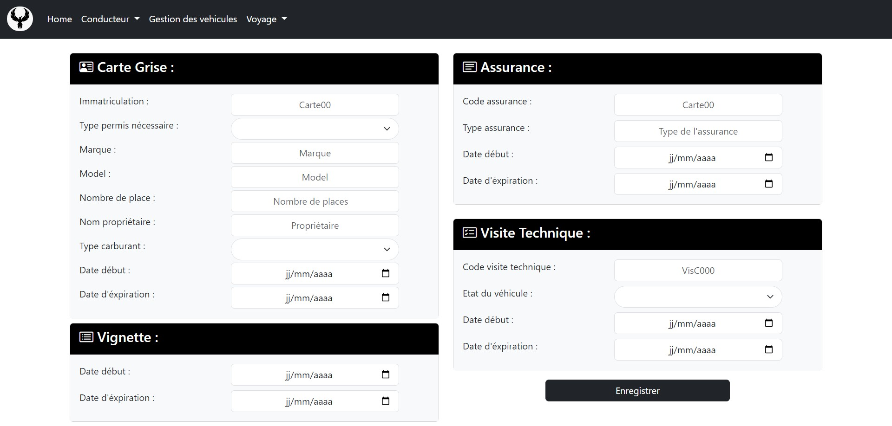

#### 🛌 Interface de Gestion des Repos des Conducteurs

##### - Liste des repos
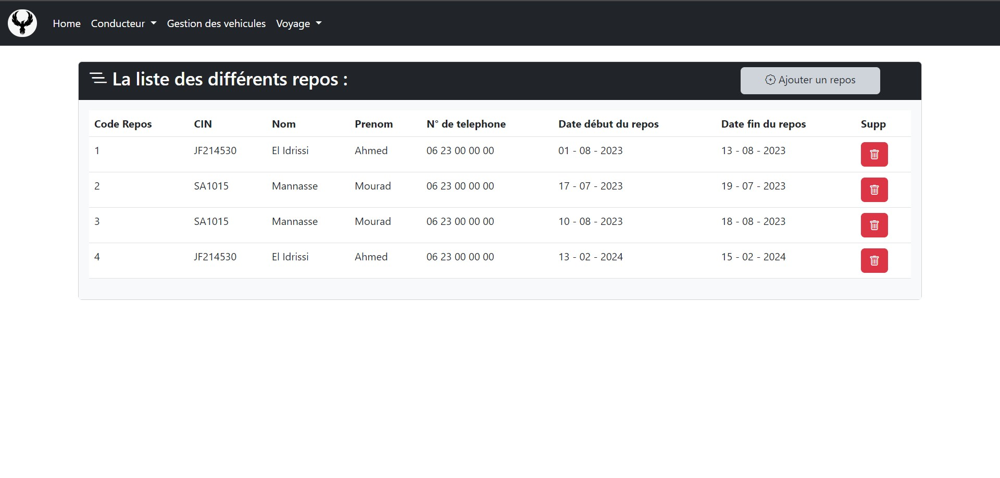

##### - Création d'un nouveau repos
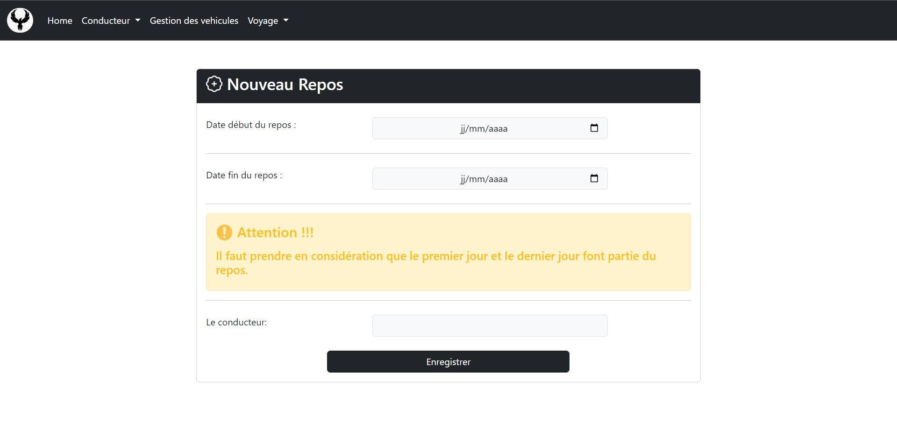

#### ✈️ Interface de Création de Nouveaux Voyages

##### - La disponibilitée et la conformitée des conducteurs et des véhicules avec le type de voyage et sa date
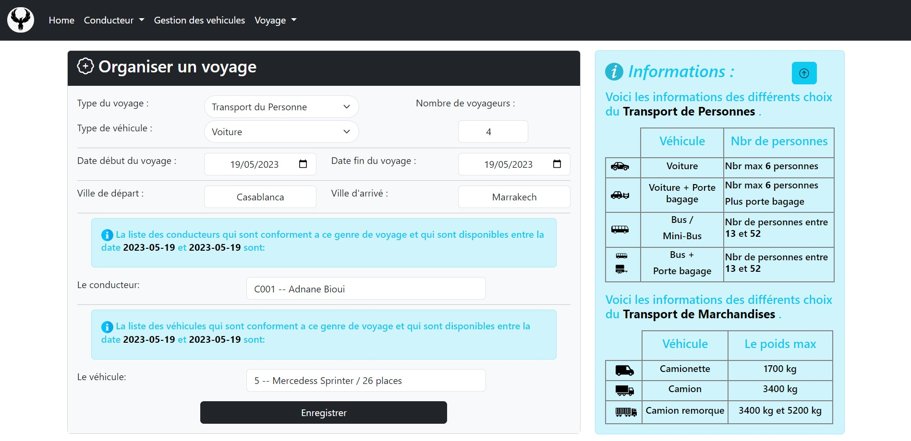

##### - La disponibilitée et la conformitée du conducteur seulement avec le type de voyage et sa date
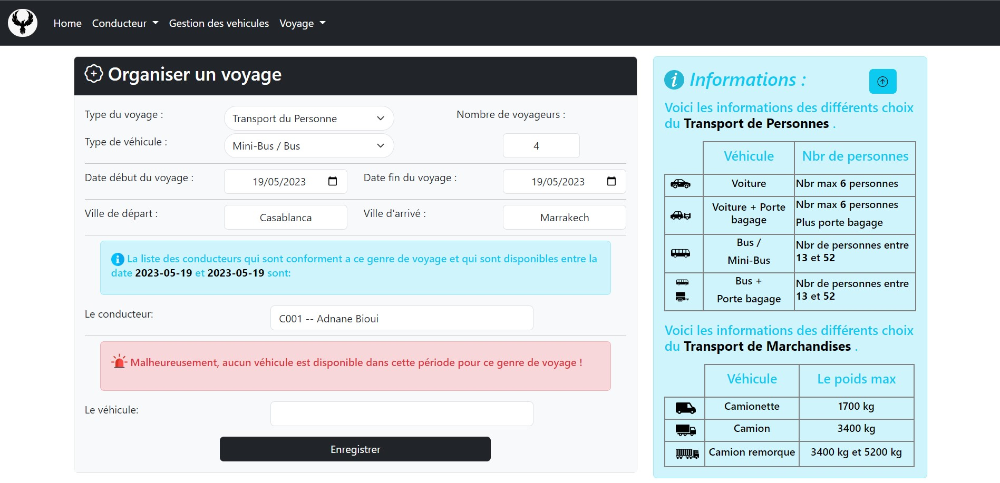

##### - Ni les conducteurs, ni les véhicules conforment et disponible avec le type de ce voyage et sa date
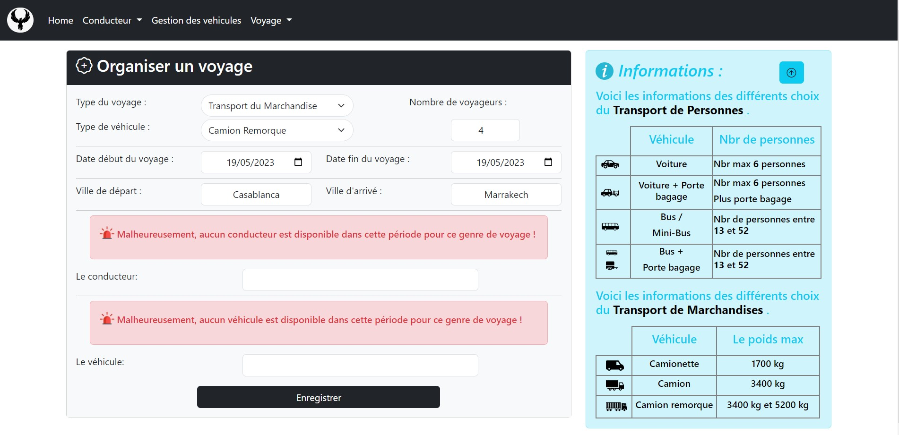

## 🔗 Lien avec la Partie Backend

👉Pour une expérience complète, consulte également la partie **backend** de l'application qui s'occupe des différents traitements de l'application : <a href="https://github.com/BiouiAdnane/Backend-Application---Gestion-des-Services-de-Messagerie-et-de-Transport" target="_blank">Lien vers le dépôt Backend</a>.
